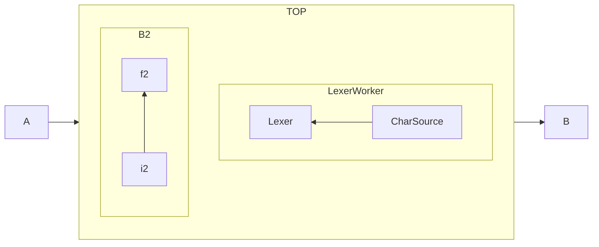

# Expression-Parser

Expression Parser supports division, addition, subtraction, multiplication, minus operator.

Parser runs in linear time using the recursive descent method. Application also has special exceptions special exceptions responsible for overflows, division by zero, and expression legibility. 

